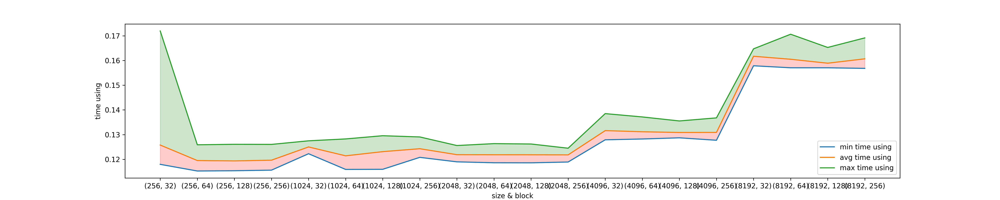
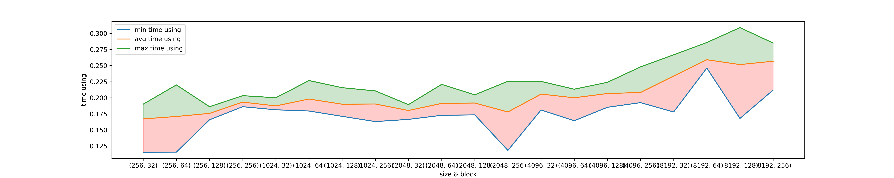
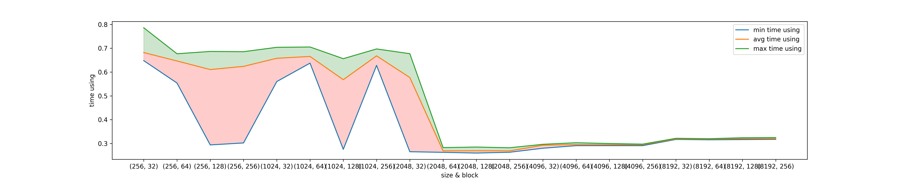

# 并行程序设计`CUDA`作业2

学号:20337011 姓名:陈俊皓

## 实验要求
矩阵与向量的乘法
- 给定一个输入矩阵$\textbf{A}$及向量$b$, 输出其向量$c=\textbf{A} \cdot b$

回到以下问题:

1. 介绍程序整体逻辑，包含的函数，每个函数完成的内容。
2. 讨论矩阵大小及线程组织对性能的影响，可考虑但不限于以下因素。
3. 优化。

## 实验过程

### 程序逻辑介绍

#### 用于测试的文件读写模块
在此次实验中，需要比对并行计算结果与正确结果的误差。此处利用文件读写模块实现上述功能，具体方法是实现如下两个函数:

```hpp
void readFile(const char* filePath, float *&mat, float *&vec, int &row, int &col);
void testFile(const char* filePath, float *res,int row);
```

对于`readFile`函数，我们需要注意的是由于`cuda`在数据分发上不支持`vector`的数据。因此，利用`vector`暂存数据后需要将其数据数据转移到全局的数组中。具体的实现过程如下:
```cpp
void readFile(const char* filePath, float *&mat, float *&vec ,int &row,int &col){
    std::ifstream inFile(filePath, std::ios::binary);
    std::vector<float> matrixInput;
    std::vector<float> vecInput;

    if(inFile.is_open()){
        inFile.read(reinterpret_cast<char *>(&row), sizeof(int));
        inFile.read(reinterpret_cast<char *>(&col), sizeof(int));

        matrixInput.resize(row * col);
        vecInput.resize(col);

        // read the input
        inFile.read(reinterpret_cast<char *>(matrixInput.data()), matrixInput.size() * sizeof(float));
        inFile.read(reinterpret_cast<char *>(vecInput.data()), vecInput.size() * sizeof(float));

        inFile.close();

        // translate it into array form
        mat = globalAllocaMat1Dim(row, col, false);
        vec = globalAllocaVec(col, false);


        for(int i = 0; i < row * col; i++){
            mat[i] = matrixInput[i];
        }

        for(int i = 0; i < col; i++){
            vec[i] = vecInput[i];
        }

    }else{
        std::cout << "Unable to open file\n";
    }
}
```

对于输出函数`testFile`,实现过程如下:
```cpp
void testFile(const char* filePath, float* res,int row){
    std::ofstream outFile_out(filePath, std::ios::binary);
    if (outFile_out.is_open()) {
        vector<float> result(res, res + row);
        // for(int i = 0;i < row ; i++){
        //     cout<<result[i]<<"\t";
        // }
        outFile_out.write(reinterpret_cast<const char *>
        (result.data()), result.size() * sizeof(float));
        outFile_out.close();

    } else {
        std::cout << "Unable to open file";
    }   
}
```

#### `cuda`并行函数设计
在此次实验中，我们首先实现一维矩阵的乘法。通过划分数据域范围，我们可以定义全局分配及释放内存的函数，生成随机数据的函数以及核函数等类型。总体实现函数如下:
```C
__global__ void matrixVectorMutiply1Dim(float *A,float *b, float *c,int row,int col);

void matrixVectorMutiplyExecute1Dim(float* mat, float* vec, float* res, int row, int col,int blockSize);

float* globalAllocaMat1Dim(int row, int col, bool isRand);
// float* globalAllocaMat2Dim(int row, int col, bool isRand = false);
float* globalAllocaVec(int length, bool isRand);

void produceRandomArray(float* mat,int size);
void globalFree(float* mat,float *vec, float *result);

```
##### 主函数变量存储设置及初始值分配
针对初始化的矩阵$A$，首先设置矩阵的大小以及是否进行随机初始化。而后，对于二维存储的情况，我们可以首先初始化一个连续的矩阵存储空间，然后将每一行元素的地址赋值给最终返回值对应的元素。这样即可以方便连续访存，在释放内存的时候也会更加高效且可以避免内存的泄漏的问题。具体的实现如下:
```cpp
float* globalAllocaMat1Dim(int row, int col, bool isRand){
    float* mat = (float*)malloc(row * col * sizeof(float));
    int matSize = row * col;

    if(isRand){
        produceRandomArray(mat, matSize);
    }else{
        memset(mat, 0, matSize * sizeof(float));
    }

    return mat;
}

float** globalAllocaMat2Dim(int row, int col, bool isRand){
    float* mat = (float*)malloc(row * col * sizeof(float));
    int matSize = row * col;

    if(isRand){
        produceRandomArray(mat, matSize);
    }else{
        memset(mat, 0, matSize * sizeof(float));
    }

    float** mat2Dim = (float**)malloc(row * sizeof(float*));
    for(int i=0; i < row; i++){
        mat2Dim[i] = &mat[i * (int)col];
    }

    return mat2Dim;
}
```


在上述函数中，我们注意到其调用了`produceRandomArray`的方法，该方法是用于随机初始化输入的一维向量的。具体实现如下:
```C
void produceRandomArray(float* mat,int size){
    for(int i=0; i < size; i++){
        mat[i]=rand() / (float)RAND_MAX * 125; 
    }
}
```

一维向量的定义方式与一维矩阵的定义类似，只是输入参数减少为`1`个。具体实现如下:
```cpp
float* globalAllocaVec(int length, bool isRand){
    float* vec = (float*)malloc(length * sizeof(float));
    if(isRand){
        produceRandomArray(vec, length);
    }else{
        memset(vec, 0, length * sizeof(float));
    }

    return vec;
}
```

由于此处没有使用类组织变量，因此无法通过调用析构函数的方式释放分配的资源。此处利用`globalFree`函数进行资源回收，具体实现如下:
```cpp
void globalFree(float* mat,float *vec, float *result){
    free(mat);
    free(vec);
    free(result);

    return;
}
```

##### `gpu`运行函数定义
首先，我们定义出此次任务中的核函数。针对一维存储矩阵的情况，我们仅需要利用一维的存储方式即可完成寻址过程，具体的实现如下:
```cpp
__global__ void matrixVectorMutiply1Dim(float *A, float *b, float *c,int row,int col){
    int i = blockIdx.x * blockDim.x + threadIdx.x;
    if(i < row){
        float sum = 0.0;
        for(int j =0; j < col; j++){
            sum += A[i * col + j] * b[j];
        }
        c[i] = sum;
    }
}
```

而后，我们可以建立主机与`gpu`之间数据相互传递的函数`matrixVectorMutiplyExecute1Dim`。在此次任务中，总共有三个变量需要进行传递，分别为输入的矩阵，输入的向量以及输出的向量。具体的实现过程与上个实验大致相同，具体的实现如下:
```cpp
void matrixVectorMutiplyExecute1Dim(float* mat, float* vec, float* res, int row, int col,int blockSize){
    // value pass to GPU memory
    float *distributedMat = NULL;
    float *distributedVec = NULL;
    float *distributedRes = NULL;

    // calculate szie
    int matSize = row * col *sizeof(float);
    int vecSize = col * sizeof(float);
    int resSize = row * sizeof(float);

    // prepare the value
    cudaMalloc(&distributedMat, matSize);
    cudaMalloc(&distributedVec, vecSize);
    cudaMalloc(&distributedRes, resSize);

    cudaMemcpy(distributedMat, mat, matSize, cudaMemcpyHostToDevice);
    cudaMemcpy(distributedVec, vec, vecSize, cudaMemcpyHostToDevice);
    cudaMemcpy(distributedRes, res, resSize, cudaMemcpyHostToDevice);

    // launch the kernel
    dim3 dimBlock(blockSize);
    dim3 dimGrid((row + blockSize - 1) / blockSize);

    matrixVectorMutiply1Dim<<<dimBlock,dimGrid>>>(distributedMat, distributedVec, distributedRes, row, col);

    // remove data from device to host
    cudaMemcpy(res,distributedRes,resSize,cudaMemcpyDeviceToHost);

    // free memory
    cudaFree(distributedMat);
    cudaFree(distributedVec);
    cudaFree(distributedRes);

    return;
}
```

#### 主函数设计
在此次的实验中，为了方便使用者运行程序，加入输入参数解析以及打印`help`信息的功能。首先展示进行输入参数解析的类:

```cpp
string helpTxt = \
"help:  [name]                  [option...]\n"
"       -m  --mode              test/random\n"
"       -t  --test-case         1...5\n"
"       --time                   true/false\n"
"       -b  --block-size        set block size\n"
"       -i  --input-size        set input-size\n";

class InputParser{
public:
    InputParser (int &argc, char **argv){
        for (int i=1; i < argc; ++i)
            this->tokens.push_back(std::string(argv[i]));
    }

    const std::string& getCmdOption(const std::string &option) const{
        std::vector<std::string>::const_iterator itr;
        itr =  std::find(this->tokens.begin(), this->tokens.end(), option);
        if (itr != this->tokens.end() && ++itr != this->tokens.end()){
            return *itr;
        }
        static const std::string empty_string("");
        return empty_string;
    }

    bool cmdOptionExists(const std::string &option) const{
        return std::find(this->tokens.begin(), this->tokens.end(), option)
               != this->tokens.end();
    }
private:
    std::vector <std::string> tokens;
};
```

运行程序后，输入`--help`为参数可以看到如下结果:
```sh
(base) jianghao@club02:/data3/cjh/并行程序设计/lab4/original_version$ ./mat_vec_multiply --help
help:  [name]                  [option...]
       -m  --mode              test/random
       -t  --test-case         1...5
       --time                   true/false
       -b  --block-size        set block size
       -i  --input-size        set input-size
```

接下来，解释每个参数的含义与内容。

首先是`-m`参数，这个参数用于表明此次运行是否需要读入`.in`文件以及是否需要输出`.out`文件。如果参数为`test`，表示需要；如果参数为`random`，表示随机生成输入数据且不需要输出结果。

`-t`参数表示使用哪个输入的文件,`1,..,5`分别表示第一到第五个输入文件。

`-time`表示使用计时器进行计时。

`-b`表示核函数的`block`大小。

`-i`表示输入矩阵的大小，此处设定矩阵的行和宽一致。

总体实现如下:
```cpp
int main(int argc, char* argv[]){
    InputParser input(argc, argv);

    if(input.cmdOptionExists("-h") || input.cmdOptionExists("--help")){
        cout<<helpTxt;
        exit(1);
    }

    // initial data
    string mode;
    if(input.cmdOptionExists("-m") || input.cmdOptionExists("--mode")){
        if(input.cmdOptionExists("-m"))
            mode = input.getCmdOption("-m");
        else
            mode = input.getCmdOption("--mode");
    }else{
        fprintf(stderr, "need the mode arment");
    }

    float* mat = NULL, *vec = NULL, *res = NULL;
    int row=256 , col=256;

    string fileInPath,fileOutPath;
    if(mode == "test"){
        // test mode
        if(input.cmdOptionExists("-t") || input.cmdOptionExists("--test-case")){
            if(input.cmdOptionExists("-t")){
                fileInPath = "../validation_file/test"+input.getCmdOption("-t")+".in";
                fileOutPath = "../validation_file/my_test"+input.getCmdOption("-t")+".out";
            }
            else{
                fileInPath = "../validation_file/test"+input.getCmdOption("--test-case")+".in";
                fileOutPath = "../validation_file/my_test"+input.getCmdOption("--test-case")+".out";
            }
        }

        // cout<<fileInPath<<endl;
        // load data
        readFile(fileInPath.data(),mat, vec, row, col);
        res = globalAllocaVec(row, true);
    }else{
        if(input.cmdOptionExists("-i") || input.cmdOptionExists("--input-size")){
            if(input.cmdOptionExists("-i")){
                row = atoi(input.getCmdOption("-i").c_str());
                col = atoi(input.getCmdOption("-i").c_str());
            }else{
                row = atoi(input.getCmdOption("--input-size").c_str());
                col = atoi(input.getCmdOption("--input-size").c_str());
            }
        }

        mat = globalAllocaMat1Dim(row, col, true);
        vec = globalAllocaVec(col, true);
        res = globalAllocaVec(row, true);
    }


    // set default block value
    int blockSize = 32;
    if(input.cmdOptionExists("-b") || input.cmdOptionExists("--block-size")){
        if(input.cmdOptionExists("-b"))
            blockSize = atoi(input.getCmdOption("-b").c_str());
        else
            blockSize = atoi(input.getCmdOption("--block-size").c_str());
    }

    // timer setting
    struct timeval start, end;
    if(input.cmdOptionExists("--time")){
        gettimeofday(&start, NULL);
    }

    // launch computing
    matrixVectorMutiplyExecute1Dim(mat, vec, res, row, col, blockSize);

    if(input.cmdOptionExists("--time")){
        gettimeofday(&end,NULL);
        double time_using=1e6*(end.tv_sec-start.tv_sec)+end.tv_usec-start.tv_usec;
        printf("time using:%lfs\n",time_using/1e6);
    }

    // free the memory
    if(mode == "random"){
        globalFree(mat, vec, res);
    }else{
        testFile(fileOutPath.data(), res, row);
        globalFree(mat, vec, res);
    }

    return 0;
}
```

#### `makefile`设计
由于此次实验设计多个程序与头文件，此处使用`makefile`进行项目编译，内容如下:
```makefile
CC = nvcc
CXX = g++
CFLAGS =-O2

SRCDIR = src
OBJDIR = obj

SRCS = $(wildcard $(SRCDIR)/*.cu)
OBJS = $(patsubst $(SRCDIR)/%.cu, $(OBJDIR)/%.o, $(SRCS))

TARGET = mat_vec_multiply

.PHONY: all
all: $(TARGET)

$(TARGET): $(OBJS)
	$(CC) $(CFLAGS) $(OBJS) -o $(TARGET)

$(OBJDIR)/%.o: $(SRCDIR)/%.cu
	$(CC) $(CFLAGS) -c $< -o $@

.PHONY: clean
clean:
	rm -f $(OBJDIR)/*.o $(TARGET)
```

#### `run.sh`设计
为了方便对程序结果进行测试以及性能评估，利用脚本`run.sh`进行运行时输出重定向，具体内容如下:
```sh
#! /bin/bash

sizes=("256" "1024" "2048" "4096" "8192")
block_sizes=("32" "64" "128" "256")
output_file="time_using.txt"

echo "" > "${output_file}"

# 测试文件输出
if [ $1 == "test" ];then
    for i in {1..5}
    do
        ./mat_vec_multiply -m test -t ${i}
    done
fi

for size in "${sizes[@]}"
do
    for block_size in "${block_sizes[@]}"
    do 
        echo "参数列表: size(${size},${size})  block_size(${block_size})" >> "${output_file}"
        for i in {1..10}
        do 
            ./mat_vec_multiply -m random -b ${block_size} -i ${size} --time>> "${output_file}"
        done
    done
done
```

此处利用脚本文件的第一个参数判定是否需要输出结果。而后，改变输入矩阵以及`block`的大小，对性能进行评估。

#### 评估程序设计

为了更高效的比对输出结果与正确结果，此处设计了一个评估程序，用于比对二者的内容。具体实现如下:
```cpp
void readSize(const char* filePath, int &row,int &col){
    std::ifstream inFile(filePath, std::ios::binary);

    if(inFile.is_open()){
        std::cout << "open file "<<filePath<<" successsed\n";
        inFile.read(reinterpret_cast<char *>(&row), sizeof(int));
        inFile.read(reinterpret_cast<char *>(&col), sizeof(int));
        inFile.close();
        return;
    }else{
        std::cout << "Unable to open file"<<filePath<<"\n";
    }
}

vector<float> readResult(const char* filePath, const int &length){
    std::ifstream inFile(filePath, std::ios::binary);
    vector<float> vec;
    vec.resize(length);

    if(inFile.is_open()){

        // read the input
        std::cout << "open file "<<filePath<<" successsed\n";
        inFile.read(reinterpret_cast<char *>(vec.data()), length * sizeof(float));
        inFile.close();

        return vec;
    }else{
        std::cout << "Unable to open file\n";
    }
}

int main(int argc, char* argv[]){
    int row , col;

    for(int round = 0; round < 5; round++){
        char standard_file_in[50], standard_file_out[50], my_file_path[50];
        sprintf(standard_file_in, "./test%d.in", round+1);
        sprintf(standard_file_out, "./test%d.out", round+1);
        sprintf(my_file_path, "./original_version/my_test%d.out", round+1);

        readSize(standard_file_in, row, col);
        vector<float> standardRes = readResult(standard_file_out, row);
        vector<float> myRes = readResult(my_file_path, row);
    
        for(int i = 0; i < row; i++){
            if(fabs(standardRes[i] - myRes[i]) > 1e-4){
                cout<<"error"<<endl;
                exit(1);
            }
        }

        cout<<"test "<<round+1<<" passed"<<endl;
    }
    return 0;
}
```

## 优化过程

### 纹理内存提升访存效率

首先，设置纹理内存所用的变量:
```cpp
texture<float, 1, cudaReadModeElementType> textMatrix;
texture<float, 1, cudaReadModeElementType> textVector;
```

在数据传输函数中绑定纹理内存:
```cpp
void matrixVectorMutiplyExecute1Dim(float* mat, float* vec, float* res, int row, int col,int blockSize){
    ...
    // bind texture emmory
    cudaBindTexture(NULL, textMatrix, distributedMat, matSize);
    cudaBindTexture(NULL, textVector, distributedVec, vecSize);
    ...
}
```

在核函数中利用纹理内存进行计算:
```cpp
__global__ void matrixVectorMutiply1Dim(float *A, float *b, float *c,int row,int col){
    int i = blockIdx.x * blockDim.x + threadIdx.x;
    if(i < row){
        float sum = 0.0;
        for(int j =0; j < col; j++){
            sum += tex1Dfetch(textMatrix, i * col + j) * tex1Dfetch(textVector, j);
        }
        c[i] = sum;
    }
}
```

### `cublas`优化
`cublas`是`cuda`自带的用于进行线性代数运算的库，具体的应用过程是:首先初始化句柄;然后利用该句柄作为参数，调用`cublasSgemv`进行计算。
```cpp
void matrixVectorMutiplyExecute1Dim(float* mat, float* vec, float* res, int row, int col,int blockSize){
    ...
    cublasHandle_t handle;
    cublasCreate(&handle);
    float alpha = 1.0f, beta = 0.0f;

    cublasSgemv(handle, CUBLAS_OP_N, row, col, &alpha, distributedMat, row, distributedVec, col, &beta, distributedRes, 1);
    ...
}
```

## 实验结果
### `original_version`结果
所用最少时间统计:
<table>
    <thead>
        <th>index</th>
        <th>row/col</th>
        <th>block size</th>
        <th>minimum time using</th>
    </thead>
    <tbody>
        <tr>
            <td rowspan=4>1</td>
            <td rowspan=4>256</td>
            <td>32</td>
            <td>0.117961s</td>
        </tr>
        <tr>
            <td>64</td>
            <td>0.115269s</td>
        </tr>
        <tr>
            <td>128</td>
            <td>0.115377s</td>
        </tr>
        <tr>
            <td>256</td>
            <td>0.115616s</td>
        </tr>
        <tr>
            <td rowspan=4>2</td>
            <td rowspan=4>1024</td>
            <td>32</td>
            <td>0.123066s</td>
        </tr>
        <tr>
            <td>64</td>
            <td>0.115910s</td>
        </tr>
        <tr>
            <td>128</td>
            <td>0.115958s</td>
        </tr>
        <tr>
            <td>256</td>
            <td>0.122396s</td>
        </tr>
        <tr>
            <td rowspan=4>3</td>
            <td rowspan=4>2048</td>
            <td>32</td>
            <td>0.118988s</td>
        </tr>
        <tr>
            <td>64</td>
            <td>0.118605s</td>
        </tr>
        <tr>
            <td>128</td>
            <td>0.119696s</td>
        </tr>
        <tr>
            <td>256</td>
            <td>0.118908s</td>
        </tr>
        <tr>
            <td rowspan=4>4</td>
            <td rowspan=4>4096</td>
            <td>32</td>
            <td>0.127896s</td>
        </tr>
        <tr>
            <td>64</td>
            <td>0.128224s</td>
        </tr>
        <tr>
            <td>128</td>
            <td>0.128702s</td>
        </tr>
        <tr>
            <td>256</td>
            <td>0.127919s</td>
        </tr>
        <tr>
            <td rowspan=4>4</td>
            <td rowspan=4>8192</td>
            <td>32</td>
            <td>0.157856s</td>
        </tr>
        <tr>
            <td>64</td>
            <td>0.157429s</td>
        </tr>
        <tr>
            <td>128</td>
            <td>0.157762s</td>
        </tr>
        <tr>
            <td>256</td>
            <td>0.157006s</td>
        </tr>
    </tbody>
</table>

可视化结果如下:


### 纹理内存优化结果
所用最少时间统计:
<table>
    <thead>
        <th>index</th>
        <th>row/col</th>
        <th>block size</th>
        <th>minimum time using</th>
    </thead>
    <tbody>
        <tr>
            <td rowspan=4>1</td>
            <td rowspan=4>256</td>
            <td>32</td>
            <td>0.115420s</td>
        </tr>
        <tr>
            <td>64</td>
            <td>0.115539s</td>
        </tr>
        <tr>
            <td>128</td>
            <td>0.166561s</td>
        </tr>
        <tr>
            <td>256</td>
            <td>0.186106s</td>
        </tr>
        <tr>
            <td rowspan=4>2</td>
            <td rowspan=4>1024</td>
            <td>32</td>
            <td>0.182957s</td>
        </tr>
        <tr>
            <td>64</td>
            <td>0.179412s</td>
        </tr>
        <tr>
            <td>128</td>
            <td>0.171129s</td>
        </tr>
        <tr>
            <td>256</td>
            <td>0.187883s</td>
        </tr>
        <tr>
            <td rowspan=4>3</td>
            <td rowspan=4>2048</td>
            <td>32</td>
            <td>0.172062s</td>
        </tr>
        <tr>
            <td>64</td>
            <td>0.172742s</td>
        </tr>
        <tr>
            <td>128</td>
            <td>0.173408s</td>
        </tr>
        <tr>
            <td>256</td>
            <td>0.118212s</td>
        </tr>
        <tr>
            <td rowspan=4>4</td>
            <td rowspan=4>4096</td>
            <td>32</td>
            <td>0.194958s</td>
        </tr>
        <tr>
            <td>64</td>
            <td>0.164285s</td>
        </tr>
        <tr>
            <td>128</td>
            <td>0.185167s</td>
        </tr>
        <tr>
            <td>256</td>
            <td>0.192421s</td>
        </tr>
        <tr>
            <td rowspan=4>4</td>
            <td rowspan=4>8192</td>
            <td>32</td>
            <td>0.177902s</td>
        </tr>
        <tr>
            <td>64</td>
            <td>0.167842s</td>
        </tr>
        <tr>
            <td>128</td>
            <td>0.211904s</td>
        </tr>
        <tr>
            <td>256</td>
            <td>0.157006s</td>
        </tr>
    </tbody>
</table>

可视化结果如下:


### `cublas`优化结果
所用最少时间统计:
<table>
    <thead>
        <th>index</th>
        <th>row/col</th>
        <th>block size</th>
        <th>minimum time using</th>
    </thead>
    <tbody>
        <tr>
            <td rowspan=4>1</td>
            <td rowspan=4>256</td>
            <td>32</td>
            <td>0.648023s</td>
        </tr>
        <tr>
            <td>64</td>
            <td>0.554065s</td>
        </tr>
        <tr>
            <td>128</td>
            <td>0.294082s</td>
        </tr>
        <tr>
            <td>256</td>
            <td>0.302334s</td>
        </tr>
        <tr>
            <td rowspan=4>2</td>
            <td rowspan=4>1024</td>
            <td>32</td>
            <td>0.560122s</td>
        </tr>
        <tr>
            <td>64</td>
            <td>0.637500s</td>
        </tr>
        <tr>
            <td>128</td>
            <td>0.275633s</td>
        </tr>
        <tr>
            <td>256</td>
            <td>0.627955s</td>
        </tr>
        <tr>
            <td rowspan=4>3</td>
            <td rowspan=4>2048</td>
            <td>32</td>
            <td>0.521892s</td>
        </tr>
        <tr>
            <td>64</td>
            <td>0.262908s</td>
        </tr>
        <tr>
            <td>128</td>
            <td>0.259942s</td>
        </tr>
        <tr>
            <td>256</td>
            <td>0.263262s</td>
        </tr>
        <tr>
            <td rowspan=4>4</td>
            <td rowspan=4>4096</td>
            <td>32</td>
            <td>0.280178s</td>
        </tr>
        <tr>
            <td>64</td>
            <td>0.293269s</td>
        </tr>
        <tr>
            <td>128</td>
            <td>0.291072s</td>
        </tr>
        <tr>
            <td>256</td>
            <td>0.293921s</td>
        </tr>
        <tr>
            <td rowspan=4>4</td>
            <td rowspan=4>8192</td>
            <td>32</td>
            <td>0.317993s</td>
        </tr>
        <tr>
            <td>64</td>
            <td>0.315600s</td>
        </tr>
        <tr>
            <td>128</td>
            <td>0.316574s</td>
        </tr>
        <tr>
            <td>256</td>
            <td>0.317898s</td>
        </tr>
    </tbody>
</table>

可视化结果如下:


### 实验结果总结
1. 针对不同的矩阵大小，最优的`block-size`会发生改变；
2. 随着`block-size`的增大，时间消耗的方差减少，推测与访存次数趋于收敛有关。
3. 在此次实验中，使用缓存优化无明显的优势，猜测与数据独立性与连续性相关。

## 实验心得
通过此次实验，我更加了解了`cuda`编程的代码规范与优化方法。