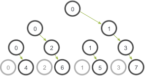

# 并行程序设计第二次实验

<table>
<tbody>
    <tr>
        <td>教学班级:并行程序设计</td>
        <td>专业(方向):计算机科学与技术(人工智能与大数据)</td>
    </tr>
    <tr>
        <td>学号：20337011</td>
        <td>姓名：陈俊皓</td>
    </tr>
    <tr>
        <td>Email:chenjh535@mail2.sysu.edu.cn</td>
        <td>完成日期:2023.3.19</td>
    </tr>
</tbody>
</table>

# 实验要求

+ 任务一:通过MPI实现通用矩阵乘法
+ 任务二:基于MPI的通用矩阵乘法优化
+ 任务三:改造Lab1成矩阵乘法库函数
+ 任务四:构造MPI版本矩阵乘法加速比和并行效率表

# 实验过程和核心代码

## 任务一

### MPI 的发送和接收简介
MPI 的发送和接收方法是按以下方式进行的：开始的时候，*A* 进程决定要发送一些消息给 *B* 进程。A进程就会把需要发送给B进程的所有数据打包好，放到一个缓存里面。因为所有数据会被打包到一个大的信息里面，因此缓存常常会被比作*信封*（就像我们把好多信纸打包到一个信封里面然后再寄去邮局）。数据打包进缓存之后，通信设备（通常是网络）就需要负责把信息传递到正确的地方。这个正确的地方也就是根据特定秩确定的那个进程。

尽管数据已经被送达到 B 了，但是进程 B 依然需要确认它想要接收 A 的数据。一旦它确定了这点，数据就被传输成功了。进程 A 会接收到数据传递成功的信息，然后去干其他事情。

有时候 A 需要传递很多不同的消息给 B。为了让 B 能比较方便地区分不同的消息，MPI 运行发送者和接受者额外地指定一些信息 ID (正式名称是*标签*, *tags*)。当 B 只要求接收某种特定标签的信息的时候，其他的不是这个标签的信息会先被缓存起来，等到 B 需要的时候才会给 B。

MPI 发送和接收方法的定义如下:

```cpp
MPI_Send(
    void* data,
    int count,
    MPI_Datatype datatype,
    int destination,
    int tag,
    MPI_Comm communicator)
```

```cpp
MPI_Recv(
    void* data,
    int count,
    MPI_Datatype datatype,
    int source,
    int tag,
    MPI_Comm communicator,
    MPI_Status* status)
```

### 基础 MPI 数据结构
`MPI_send` 和 `MPI_Recv` 方法使用了 MPI 的数据结构作为一种在更高层次指定消息结构的方法。举例来说，如果一个进程想要发送一个整数给另一个进程，它会指定 count 为 1，数据结构为 `MPI_INT`。其他的 MPI 数据结构以及它们在 C 语言里对应的结构如下：

| MPI datatype | C equivalent |
| --- | --- |
| MPI_SHORT | short int |
| MPI_INT | int |
| MPI_LONG | long int |
| MPI_LONG_LONG | long long int |
| MPI_UNSIGNED_CHAR | unsigned char |
| MPI_UNSIGNED_SHORT | unsigned short int |
| MPI_UNSIGNED | unsigned int |
| MPI_UNSIGNED_LONG | unsigned long int |
| MPI_UNSIGNED_LONG_LONG | unsigned long long int |
| MPI_FLOAT | float |
| MPI_DOUBLE | double |
| MPI_LONG_DOUBLE | long double |
| MPI_BYTE | char |

### 输入矩阵分发
在实现的过程中，我们考虑到每个进程需要分配到的数据数量。根据矩阵分解理论，此处决定分解`mat1`将其个数为`num_row_per_proc=mat1_row/world_size`的行分发给每一个进程，并将完整的`mat2`发送给每个进程。

此时，每一个进程计算得到的矩阵乘法结果`part_result`将对应于最终的结果矩阵中`result`的特定行(与分配的`mat1`的行序号相同)。

上述操作将在根进程(`world_rank==0`)上进行，具体的操作流程如下:
```C
// root send data
if(world_rank==0){
    //send mat1,each row
    for(int process=0;process<world_size;process++){
        for(int i=0;i<num_row_per_proc;i++){
            MPI_Send(&mat1[process*num_row_per_proc+i][0],mat1_col,MPI_FLOAT,
                    process,i,MPI_COMM_WORLD);
        }
    }

    //send mat2
    for(int process=0;process<world_size;process++){
        for(int i=0;i<mat2_row;i++){
            MPI_Send(&mat2[i][0],mat2_col,MPI_FLOAT,
                    process,i,MPI_COMM_WORLD);
        }
        // printf("mat2_row:%d mat2_col:%d\n",mat2_row,mat2_col);
    }
}

...
// process receive
for(int i=0;i<num_row_per_proc;i++){
    MPI_Recv(&part_mat1[i][0],mat1_col,MPI_FLOAT,
            0,i,MPI_COMM_WORLD,MPI_STATUS_IGNORE);
}

for(int i=0;i<mat2_row;i++){
    MPI_Recv(&part_mat2[i][0],mat2_col,MPI_FLOAT,
            0,i,MPI_COMM_WORLD,MPI_STATUS_IGNORE);
}

MPI_Recv(parameter,3,MPI_INT,
    0,0,MPI_COMM_WORLD,MPI_STATUS_IGNORE);
```
### `part_result`聚合到根进程过程
在各进程通过`matmul()`函数得到`part_result`后，需要各自调用`MPI_Send()`函数将其结果汇聚到根进程中。根进程在汇聚了其他进程发送的数据后，得到最终的结果。

进程发送局部结果及根进程汇聚结果的过程如下:
```C
matmul(part_mat1,part_mat2,part_result,parameter);

for(int i=0;i<num_row_per_proc;i++){
    MPI_Send(&part_result[i][0],mat2_col,MPI_FLOAT,0,i,MPI_COMM_WORLD);
}
// printf("process %d send part result to root\n",world_rank);

MPI_Barrier(MPI_COMM_WORLD);


if(world_rank==0){
    for(int process=0;process<world_size;process++){
        for(int i=0;i<num_col_per_proc;i++){
            MPI_Recv(&result[process*num_row_per_proc+i][0],num_row_per_proc*mat2_col,
                    MPI_FLOAT,process,i,MPI_COMM_WORLD,&status);
        }
    }
    ...
}
```

## 任务二

### `MPI_Bcast`、`MPI_Scatter`以及`MPI_Gather`简介
#### `MPI_Bcast`的介绍
*广播* (broadcast) 是标准的集体通信技术之一。一个广播发生的时候，一个进程会把同样一份数据传递给一个 communicator 里的所有其他进程。广播的主要用途之一是把用户输入传递给一个分布式程序，或者把一些配置参数传递给所有的进程。

广播的通信模式可以看作：


在这个例子里，进程0是我们的*根*进程，它持有一开始的数据。其他所有的进程都会从它这里接受到一份数据的副本。

在 MPI 里面，广播可以使用 `MPI_Bcast` 来实现，其函数定义如下：

```cpp
MPI_Bcast(
    void* data,
    int count,
    MPI_Datatype datatype,
    int root,
    MPI_Comm communicator)
```

尽管根节点和接收节点做不同的事情，它们都是调用同样的这个 `MPI_Bcast` 函数来实现广播。当根节点(在我们的例子是节点0)调用 `MPI_Bcast` 函数的时候，`data` 变量里的值会被发送到其他的节点上。当其他的节点调用 `MPI_Bcast` 的时候，`data` 变量会被赋值成从根节点接受到的数据。

实际上的`MPI_Bcast`函数并非只有一个发送方，而是一种类似于`p2p`的网络机构。一个进程一旦完全接收数据，即可传递该数据给还未接收到的进程。这一设计提升了`MPI_Bcast`的效率，其示意图可以表示如下:



在示意图里，进程0一开始传递数据给进程1。跟我们之前的例子类似，第二个阶段的时候进程0依旧会把数据传递给进程2。这个例子中不同的是进程1在第二阶段也会传递数据给进程3。在第二阶段，两个网络连接在同时发生了。在这个树形算法里，能够利用的网络连接每个阶段都会比前一阶段翻番，直到所有的进程接受到数据为止。

#### `MPI_Scatter`的介绍
`MPI_Scatter` 是一个跟 `MPI_Bcast` 类似的集体通信机制。`MPI_Scatter` 的操作会设计一个指定的根进程，根进程会将数据发送到 communicator 里面的所有进程。`MPI_Bcast` 和 `MPI_Scatter` 的主要区别很小但是很重要。`MPI_Bcast` 给每个进程发送的是*同样*的数据，然而 `MPI_Scatter` 给每个进程发送的是*一个数组的一部分数据*。下图进一步展示了这个区别。


在图中我们可以看到，`MPI_Bcast` 在根进程上接收一个单独的数据元素（红色的方块），然后把它复制到所有其他的进程。`MPI_Scatter` 接收一个数组，并把元素按进程的秩分发出去。第一个元素（红色方块）发往进程0，第二个元素（绿色方块）发往进程1，以此类推。尽管根进程（进程0）拥有整个数组的所有元素，`MPI_Scatter` 还是会把正确的属于进程0的元素放到这个进程的接收缓存中。下面的 `MPI_Scatter` 函数的原型。

```cpp
MPI_Scatter(
    void* send_data,
    int send_count,
    MPI_Datatype send_datatype,
    void* recv_data,
    int recv_count,
    MPI_Datatype recv_datatype,
    int root,
    MPI_Comm communicator)
```

第一个参数，`send_data`，是在根进程上的一个数据数组。第二个和第三个参数，`send_count` 和 `send_datatype` 分别描述了发送给每个进程的数据数量和数据类型。如果 `send_count` 是1，`send_datatype` 是 `MPI_INT`的话，进程0会得到数据里的第一个整数，以此类推。如果`send_count`是2的话，进程0会得到前两个整数，进程1会得到第三个和第四个整数，以此类推。在实践中，一般来说`send_count`会等于数组的长度除以进程的数量。除不尽怎么办？我们会在后面的课程中讲这个问题 :-)。

函数定义里面接收数据的参数跟发送的参数几乎相同。`recv_data` 参数是一个缓存，它里面存了`recv_count`个`recv_datatype`数据类型的元素。最后两个参数，`root` 和 `communicator` 分别指定开始分发数组的根进程以及对应的communicator。

#### MPI_Gather 的介绍
`MPI_Gather` 跟 `MPI_Scatter` 是相反的。`MPI_Gather` 从好多进程里面收集数据到一个进程上面而不是从一个进程分发数据到多个进程。这个机制对很多平行算法很有用，比如并行的排序和搜索。下图是这个算法的一个示例。


跟`MPI_Scatter`类似，`MPI_Gather`从其他进程收集元素到根进程上面。元素是根据接收到的进程的秩排序的。`MPI_Gather`的函数原型跟`MPI_Scatter`长的一样。

```cpp
MPI_Gather(
    void* send_data,
    int send_count,
    MPI_Datatype send_datatype,
    void* recv_data,
    int recv_count,
    MPI_Datatype recv_datatype,
    int root,
    MPI_Comm communicator)
```

在`MPI_Gather`中，只有根进程需要一个有效的接收缓存。所有其他的调用进程可以传递`NULL`给`recv_data`。另外，*recv_count*参数是从*每个进程*接收到的数据数量，而不是所有进程的数据总量之和。这一点对MPI初学者来说经常容易搞错。

### 矩阵初始化及资源释放(优化)
在点对点通信任务中，由于没有考虑到`(float**)malloc`函数将会使得得到的初始化矩阵结果**不连续**,而使得传递数据时只能逐行传递，拖慢了函数的运行效率。

因此，在任务二中，对任务一中的初始化以及返还资源的模块进行了优化。具体方法是:先分配一个大小为`row*col`的以为数组，然后用二维数组通过偏移计算的方式将其转化为可二维寻址的形式。具体的代码如下:

```C
void initial_matrix(float** result,int row,int col,int random){
    for(int i=0;i<row;i++){
        for(int j=0;j<col;j++){
            if(random==1){
                result[i][j]=rand()/(float)(RAND_MAX/10)-5;
            }else{
                result[i][j]=0;
            }
        }
    }
    return;
}

float** create_matrix(int row,int col,int random){
    float **result=NULL;
    float *one_dim=NULL;

    result=(float**)malloc((sizeof(float*)*row));
    one_dim=(float*)malloc(sizeof(float)*row*col);

    for(int i=0;i<row;i++){
        result[i]=&one_dim[i*col];
    }

    initial_matrix(result,row,col,random);

    return result;
}

void free_matrix(float** result){
    free(*result);
    free(result);
    result=NULL;
}
```

上述代码为了保证不会出现**内存泄漏**的问题，通过一下命令进行了验证,并证明这种初始化与释放方式不会出现该问题:
```C
gcc -fsanitize=leak -o allocate.o allocate_mat.c 
```

### 封装的`Scatter`与`Gather`函数
为了让`MPI_Scatter`以及`MPI_Gather`函数更符合矩阵乘法的场景，此处将这两个函数进行了封装。主要目的是完成地址转化的任务，具体的封装函数如下:
```C
float** scatter_matrix(MPI_Comm comm,float** mat,int row,int col,int world_rank,int world_size){
    int num_rows_per_proc=row/world_size;
    float** part_mat=create_matrix(num_rows_per_proc,col,0);
    if(mat==NULL){
        MPI_Scatter(mat,num_rows_per_proc*col,MPI_FLOAT,&part_mat[0][0],
                num_rows_per_proc*col,MPI_FLOAT,0,comm);
    }else{
        MPI_Scatter(&mat[0][0],num_rows_per_proc*col,MPI_FLOAT,&part_mat[0][0],
                num_rows_per_proc*col,MPI_FLOAT,0,comm);
    }
    return part_mat;
}

void gather_matrix(MPI_Comm comm,float** part_result,float** result,
                int col,int num_rows_per_proc){
    if(result==NULL){
        MPI_Gather(&part_result[0][0],num_rows_per_proc*col,MPI_FLOAT,result,
                num_rows_per_proc*col,MPI_FLOAT,0,comm);
    }else{
        MPI_Gather(&part_result[0][0],num_rows_per_proc*col,MPI_FLOAT,&result[0][0],
                num_rows_per_proc*col,MPI_FLOAT,0,comm);
    }
}
```
## 任务三
Lab1中的矩阵乘法函数由于具有通用性，因此可以将其编译为库函数，以供其他程序使用。

### Linux系统下编译库函数并使用的脚本
```C
#convert library code to object file
g++ -c -o library.o library.c

#create shared .SO library
gcc -shared -o libfoo.so library.object


#create the executable by linking shared library
gcc -L<path to .SO library> -Wall -o code main.c -l <library name>

#make shared library available at runtime
export LD_LIBRARY_PATH=<path to .SO file>:$LD_LIBRARY_PATH

#run executable
./a.out
```

### 封装的`matmul.hpp`文件
在头文件`matmul.hpp`中，封装了`create_matrix`、`free_matrix`以及`matmul`三个函数并且定义了矩阵结构体`matrix`。矩阵结构体的定义如下:
```C++
<template T>
typedef struct
{
    T** data;
    int row;
    int col;
}matrix;
```

### 功能实现的`matmul.cpp`文件
在文件`matmul.cpp`中，实现了在头文件中声明的三个函数，其实现方法与上一实验中相同，此处不做展示。


# 实验结果
<table>
    <thead>
        <tr>
            <td rowspan=2>Comm_size(number of processes)
            </td>
            <td colspan=5>Order of Matrix(Speedups, seconds)
            </td>
        </tr>
        <tr>
            <td>128</td>
            <td>256</td>
            <td>512</td>
            <td>1024</td>
            <td>2048</td>
        </tr>
    </thead>
    <tbody>
        <tr>
            <td>1</td>
            <td>0.008361</td>
            <td>0.088016</td>
            <td>0.593064</td>
            <td>6.392921</td>
            <td>75.463255</td>
        </tr>
        <tr>
            <td>2</td>
            <td>0.004806</td>
            <td>0.058070</td>
            <td>0.410797</td>
            <td>10.071420</td>
            <td>119.518596</td>
        </tr>
        <tr>
            <td>4</td>
            <td>0.002927</td>
            <td>0.019534</td>
            <td>0.215670</td>
            <td>5.575943</td>
            <td>71.259153</td>
        </tr>
        <tr>
            <td>8</td>
            <td>0.002668</td>
            <td>0.016798</td>
            <td>0.145822</td>
            <td>3.442982</td>
            <td>52.502953</td>
        </tr>
        <tr>
            <td>16</td>
            <td>0.002887</td>
            <td>0.014244</td>
            <td>0.102741</td>
            <td>2.584317</td>
            <td>45.223416</td>
        </tr>
    </tbody>
</table>

## 实验心得

通过此次实验，我充分了解到了`MPI`的各个接口函数的使用方法以及通用库函数的生成方式。
## 参考链接
mpi_tutorial
