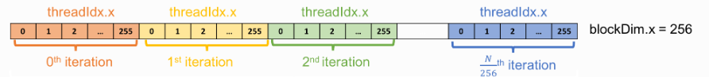
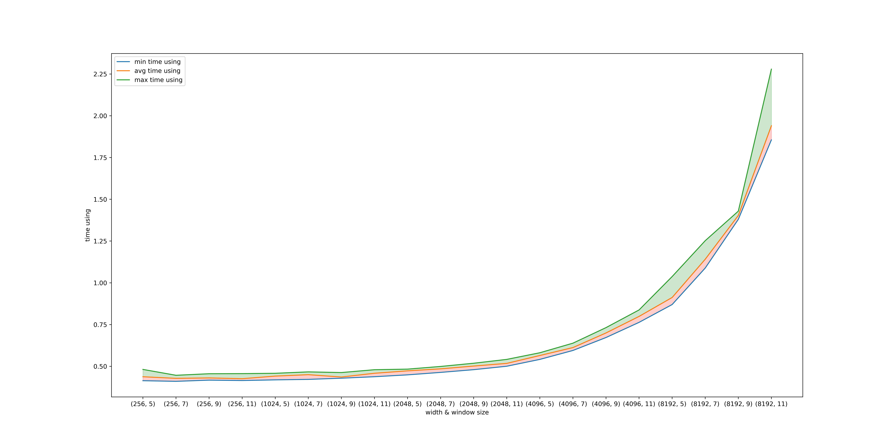
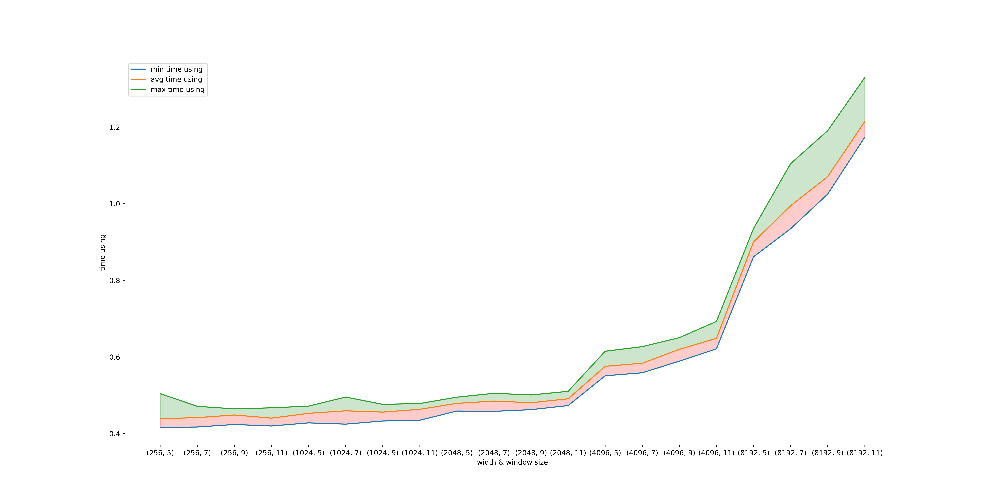

# `CUDA`程序设计第一次作业
学号:20337011 姓名:陈俊皓

## 实验要求
计算二维数组中以每个元素为中心的熵(entropy)
- 输入:二维数组及其大小(假设元素为`[0-15]`的整型)
- 输出:浮点型二维数组(保留5为小数)

## 实验过程

### 程序整体逻辑

#### 核函数`entropy_kernel`设计
对于核函数而言，此处设定每个核函数的任务为计算单个元素对应的熵值。因此，我们首先需要利用线程号以及其所属的`block`确定其对应的元素。`cuda`的显存结构如下所示:



针对计算对应元素熵的场景，我们可以得到其对应行列的计算方式如下；
```c
int x=blockIdx.x*blockDim.x+threadIdx.x;
int y=blockIdx.y*blockDim.y+threadIdx.y;
```


得到对应的坐标之后，我们遍历其周围的元素，如果其通过边界检测则将该值加入到当前熵值的计算之中：
```C
for(int i=-window_size/2;i<window_size/2;i++){
    for(int j=-window_size/2;j<window_size/2;j++){
        int nx=x+i;
        int ny=y+j;

        if(nx>=0 && nx<width && ny>=0 && ny<height){
            float value=(float)input[ny*width+nx];
            // use the value stored
            if(value==0){
                count++;
                continue;
            }
            entropy+=value*log2(value);
            count++;
        } 
    }
}
```


此处值得注意的是，当`value=0`的时候，计算结果可能会出现异常。因此，当我们我们检测到当前的读入值为`0`，则跳过此轮循环。

整体函数设计如下：
```C
__global__ void entropy_kernel(int* input,float* output,int width,int height,int window_size){
    int x=blockIdx.x*blockDim.x+threadIdx.x;
    int y=blockIdx.y*blockDim.y+threadIdx.y;

    if(x<width && y<height){
        float entropy=0.0;
        int count=0;

        for(int i=-window_size/2;i<window_size/2;i++){
            for(int j=-window_size/2;j<window_size/2;j++){
                int nx=x+i;
                int ny=y+j;

                if(nx>=0 && nx<width && ny>=0 && ny<height){
                    float value=(float)input[ny*width+nx];
                    // use the value stored
                    if(value==0){
                        count++;
                        continue;
                    }
                    entropy+=value*log2(value);
                    count++;
                } 
            }
        }

        entropy=-entropy/count;
        output[y*width+x]=entropy;
    }
}
```

#### `allocate`函数设计
在`cuda`编程中，由于显卡只能访问显存上的内容。因此必定会涉及主机与显卡之间的数据传递与交换，`allocate`函数实现的就是相关的功能。

首先，我们定义出需要被显卡访问的数据,并让其在对应的显存上拥有相应大小的地址空间，并利用主机中的数据初始化新创建的显存变量。

针对计算熵的情景，在不涉及优化的情况下，我们需要显卡创建输入二维数组`distributedArray`以及输出熵的二维数组`distributedEntropyArray`实现以上的操作。具体的实现如下:
```C
    // value pass to GPU memory
    int *distributedArray=NULL;
    float* distributedEntropyArray=NULL;

    // calculate size
    int arraySize=width*height*sizeof(int);
    int entropySize=width*height*sizeof(float);

    // ready the value needed
    cudaMalloc(&distributedArray,arraySize);
    cudaMalloc(&distributedEntropyArray,entropySize);

    
    cudaMemcpy(distributedArray,array,arraySize,cudaMemcpyHostToDevice);
    cudaMemcpy(distributedEntropyArray,entropy,entropySize,cudaMemcpyHostToDevice);
```

完成数据传输之后，我们可以设定`block`的大小并启动核函数，让其针对每一个元素计算其熵值。具体实现如下:

```C
    // launch the kernel
    dim3 dimBlock(BLOCK_SIZE,BLOCK_SIZE);
    dim3 dimGrid((width+dimBlock.x-1)/dimBlock.x,(height+dimBlock.y-1)/dimBlock.y);

    entropy_kernel<<<dimGrid,dimBlock>>>(distributedArray,distributedEntropyArray,
        width,height,window_size);
```

完成每个元素熵值计算后，注意到计算的结果仍然位于显存中。因此，我们需要将其转移回主机的内存，已完成整个的计算过程。具体的实现方法如下:
```C
    cudaMemcpy(entropy,distributedEntropyArray,entropySize,cudaMemcpyDeviceToHost);
```

以上操作完成后即完成了整个计算过程，我们可以通过`cudaFree`函数释放之前在显存中申请的资源:

```C
    // free memory
    cudaFree(distributedArray);
    cudaFree(distributedEntropyArray);
```

整体实现如下:
```C
void allocate(int *array,float *entropy,int width,int height,int window_size){
    // value pass to GPU memory
    int *distributedArray=NULL;
    float* distributedEntropyArray=NULL;

    // calculate size
    int arraySize=width*height*sizeof(int);
    int entropySize=width*height*sizeof(float);

    // ready the value needed
    cudaMalloc(&distributedArray,arraySize);
    cudaMalloc(&distributedEntropyArray,entropySize);

    
    cudaMemcpy(distributedArray,array,arraySize,cudaMemcpyHostToDevice);
    cudaMemcpy(distributedEntropyArray,entropy,entropySize,cudaMemcpyHostToDevice);

    // launch the kernel
    dim3 dimBlock(BLOCK_SIZE,BLOCK_SIZE);
    dim3 dimGrid((width+dimBlock.x-1)/dimBlock.x,(height+dimBlock.y-1)/dimBlock.y);

    entropy_kernel<<<dimGrid,dimBlock>>>(distributedArray,distributedEntropyArray,
        width,height,window_size);
    
    cudaMemcpy(entropy,distributedEntropyArray,entropySize,cudaMemcpyDeviceToHost);


    // free memory
    cudaFree(distributedArray);
    cudaFree(distributedEntropyArray);

    return;
}
```

#### `main`函数设计
`main`函数的功能在于在主存中创建源数据`array`以及目标数据`entropy`，利用文件描述符重定向输入以及输出结果并计算执行过程所用的时间。

首先，我们通过输入的参数，确定`width`,`height`,`window_size`的数据。
```C
if(argc<4){
        fprintf(stderr,"Please input the size of the 2-dimension array.\n");
        exit(1);
    }

    int width=atoi(argv[1]),height=atoi(argv[2]),window_size=atoi(argv[3]);
```

而后，我们根据输入的数据在主存中创建源数据`array`以及目标数据`entropy`。
```C
    int *array=(int*)malloc(sizeof(int)*width*height);
    float* entropy=(float*)malloc(sizeof(float)*width*height);

    // initial value between [0-15]
    for(int i=0;i<width*height;i++){
        array[i]=(int)(rand()/(float)RAND_MAX*15);
        entropy[i]=0;
    }
```

在完成随机初始化之后，我们可以把生成的输入数据利用文件描述符永久存储在磁盘文件中。
```C
    int fd;
    char INPUTFILE[]="random_input.txt";
    char OUTPUTFILE[]="entropy.txt";

    // store input
    fd=open(INPUTFILE,O_CREAT|O_WRONLY,0644);
    if(fd<0){
        fprintf(stderr,"open input file error");
        exit(1);
    }

    for(int i=0;i<width*height;i++){
        char buffer[10];
        sprintf(buffer,"%d\t",array[i]);
        write(fd,buffer,strlen(buffer));

        if((i+1) % height==0){
            write(fd,"\n",1);
        }
    }

    close(fd);
```

接下来，我们开始计算`entropy`的过程并利用计时器计时:
```C
struct timeval start,end;
    //begining timer
    gettimeofday(&start,NULL);

    // calculate
    allocate(array,entropy,width,height,window_size);

    // end timer;
    gettimeofday(&end,NULL);
    double time_using=1e6*(end.tv_sec-start.tv_sec)+end.tv_usec-start.tv_usec;
    printf("time using:%lfs\n",time_using/1e6);
```

完成结果计算后，我们可以通过重定向输出结果的方式，对结果进行验证。
```C
    // store output
    fd=open(OUTPUTFILE,O_CREAT|O_WRONLY,0644);
    if(fd<0){
        fprintf(stderr,"open input file error");
        exit(1);
    }

    for(int i=0;i<width*height;i++){
        char buffer[10];
        sprintf(buffer,"%.2f\t",entropy[i]);
        write(fd,buffer,strlen(buffer));

        if((i+1) % height==0){
            write(fd,"\n",1);
        }
    }

    close(fd);
```

最后，释放此前在主存中申请的资源。
```C
    // free memory
    free(array);
    free(entropy);
```

#### `run.sh`脚本设计
为了可以进行多组参数的独立重复实验进行比对，吃醋利用如下脚本进行实验:
```sh
#! /bin/bash

# 定义参数列表
widths=("256" "1024" "2048" "4096" "8192")
window_sizes=("5" "7" "9" "11")
output_file="time_using.txt"

echo "" > "${output_file}"

# 环遍历参数列表，运行程序并将结果输出到文件中
for  width in "${widths[@]}"
do
    for window_size in "${window_sizes[@]}"
    do 
        echo "参数列表: width(${width}) height(${width}) window_size(${window_size})" >> "${output_file}"
        for i in {1..10}
        do 

            ./allocate.o "${width}" "${width}" "${window_size}" >> "${output_file}"
        done
    done
done
```


### 实验过程中使用的内存类型
首先，此处阐述GPU上共享内存与全局内存的区别。全局内存是较大的板载内存，延迟高，共享内存是片上的较小的内存，延迟低，带宽高。全局内存就是原料工厂，要用车来运输原料，共享内存是工厂内存临时存放原料的房间，取原料路程短速度快。

在以上的程序设计中,我们可以得到，以上变量中的`distributedArray`,`distributedEntropyArray`以及`distributedLogVal`为全局内存，他们被多个`block`所共享。而核函数内的变量则存储在共享内存中。

### 程序中的对数运算化简
由于窗口大小仅为`5*5`，因此一个元素最多出现`25`次,因此只需要计算`log([0-25])`即可满足运算。我们可以通过以下途径进行相关操作:
```C
    // max window size 121
    int logSize=122;

    // store the log value first
    logVal=(float*)malloc(sizeof(float)*logSize);

    for(int i=0;i<logSize;i++){
        if(i==0){
            logVal[0]=-9999;
        }else{
            logVal[i]=log2((float)i);
        }
        // printf("%.2f ",logVal[i]);
    }

    ...
    cudaMalloc(&distributedLogVal,logSize*sizeof(float));

    ...
    cudaMemcpy(distributedLogVal,logVal,logSize*sizeof(float),cudaMemcpyHostToDevice);
```

在核函数中，还可以使用共享内存加速查找速度。
```C
 __shared__ int shared_mem[122];

    if(threadIdx.x==0){
        for(int i=0;i<122;i++){
            shared_mem[i]=logVal[i];
        }
    }

    __syncthreads();
```

## 实验结果
### `baseline`版本及共享内存优化版本的结果比较

`baseline`版本的实验结果如下:
<table>
    <thead>
        <th>index</th>
        <th>height/width</th>
        <th>window size</th>
        <th>minimum time using</th>
    </thead>
    <tbody>
        <tr>
            <td rowspan=4>1</td>
            <td rowspan=4>256</td>
            <td>5</td>
            <td>0.415947s</td>
        </tr>
        <tr>
            <td>7</td>
            <td>0.441910s</td>
        </tr>
        <tr>
            <td>9</td>
            <td>0.417371s</td>
        </tr>
        <tr>
            <td>11</td>
            <td>0.415008s</td>
        </tr>
        <tr>
            <td rowspan=4>2</td>
            <td rowspan=4>1024</td>
            <td>5</td>
            <td>0.419026s</td>
        </tr>
        <tr>
            <td>7</td>
            <td>0.421916s</td>
        </tr>
        <tr>
            <td>9</td>
            <td>0.429036s</td>
        </tr>
        <tr>
            <td>11</td>
            <td>0.437884s</td>
        </tr>
        <tr>
            <td rowspan=4>3</td>
            <td rowspan=4>2048</td>
            <td>5</td>
            <td>0.448987s</td>
        </tr>
        <tr>
            <td>7</td>
            <td>0.463723s</td>
        </tr>
        <tr>
            <td>9</td>
            <td>0.480049s</td>
        </tr>
        <tr>
            <td>11</td>
            <td>0.500640s</td>
        </tr>
        <tr>
            <td rowspan=4>4</td>
            <td rowspan=4>4096</td>
            <td>5</td>
            <td>0.541514s</td>
        </tr>
        <tr>
            <td>7</td>
            <td>0.597178s</td>
        </tr>
        <tr>
            <td>9</td>
            <td>0.672479s</td>
        </tr>
        <tr>
            <td>11</td>
            <td>0.773530s</td>
        </tr>
        <tr>
            <td rowspan=4>4</td>
            <td rowspan=4>8192</td>
            <td>5</td>
            <td>0.870115s</td>
        </tr>
        <tr>
            <td>7</td>
            <td>1.088494s</td>
        </tr>
        <tr>
            <td>9</td>
            <td>1.379959s</td>
        </tr>
        <tr>
            <td>11</td>
            <td>1.855785s</td>
        </tr>
    </tbody>
</table>

可视化结果图下图所示:


### `log`存储为共享内存后的计算结果

<table>
    <thead>
        <th>index</th>
        <th>height/width</th>
        <th>window size</th>
        <th>minimum time using</th>
    </thead>
    <tbody>
        <tr>
            <td rowspan=4>1</td>
            <td rowspan=4>256</td>
            <td>5</td>
            <td>0.415866s</td>
        </tr>
        <tr>
            <td>7</td>
            <td>:0.417153s</td>
        </tr>
        <tr>
            <td>9</td>
            <td>0.423721s</td>
        </tr>
        <tr>
            <td>11</td>
            <td>0.419780s</td>
        </tr>
        <tr>
            <td rowspan=4>2</td>
            <td rowspan=4>1024</td>
            <td>5</td>
            <td>0.427926s</td>
        </tr>
        <tr>
            <td>7</td>
            <td>0.424654s</td>
        </tr>
        <tr>
            <td>9</td>
            <td>0.438042s</td>
        </tr>
        <tr>
            <td>11</td>
            <td>0.434872s</td>
        </tr>
        <tr>
            <td rowspan=4>3</td>
            <td rowspan=4>2048</td>
            <td>5</td>
            <td>0.462477s</td>
        </tr>
        <tr>
            <td>7</td>
            <td>0.458036s</td>
        </tr>
        <tr>
            <td>9</td>
            <td>0.463657s</td>
        </tr>
        <tr>
            <td>11</td>
            <td>0.480828s</td>
        </tr>
        <tr>
            <td rowspan=4>4</td>
            <td rowspan=4>4096</td>
            <td>5</td>
            <td>0.552492s</td>
        </tr>
        <tr>
            <td>7</td>
            <td>0.561821s</td>
        </tr>
        <tr>
            <td>9</td>
            <td>0.589081s</td>
        </tr>
        <tr>
            <td>11</td>
            <td>0.621273s</td>
        </tr>
        <tr>
            <td rowspan=4>4</td>
            <td rowspan=4>8192</td>
            <td>5</td>
            <td>0.861369s</td>
        </tr>
        <tr>
            <td>7</td>
            <td>0.934650s</td>
        </tr>
        <tr>
            <td>9</td>
            <td>1.024987s</td>
        </tr>
        <tr>
            <td>11</td>
            <td>1.173519s</td>
        </tr>
    </tbody>
</table>

可视化结果图下图所示:



### 实验结果分析
可以看到，在`baseline`版本中，随着二维数组大小以及窗口大小的改变，时间消耗迅速的增加，呈$O(n^2)$增长。首先分析相同二维数组大小的情况，由于没有预先存储`log`值，因此核函数的每次执行均需要调用库函数来计算`log`值。随着窗口大小的增加，增加的计算量可近似为$O(\Delta window\_size^2)$,与图像显示的结果相同。而对于窗口大小不变而二维数组大小变化的场景，我们则需要增加核函数的执行次数，其结果与图像所示相同。

针对如上的场景，我们观察到，我们可以预先计算`log`值从而降低核函数内的计算次数。另外，核函数的访存操作其实相当频繁。我们可以将没有访问冲突(只读的变量)存入共享内存中，从而降低访存代价。

观察优化版本的实验结果，我们发现其与`baseline`版本的曲线变化趋势有所不同，此处解释为调入共享内存中`I/O`使其曲线发生变化。

### `CUDA`执行效率影响因素
通过优化结果我们可以知道，`CUDA`执行效率与访存代价直接相关(尤其是在计算量较大的情况下)。因此，我们应该将尽可能多的变量调入共享内存中，提升线程束的执行效率。

## 实验心得
通过此次实验，我了解到`CUDA`的编程方法以及优化策略。


